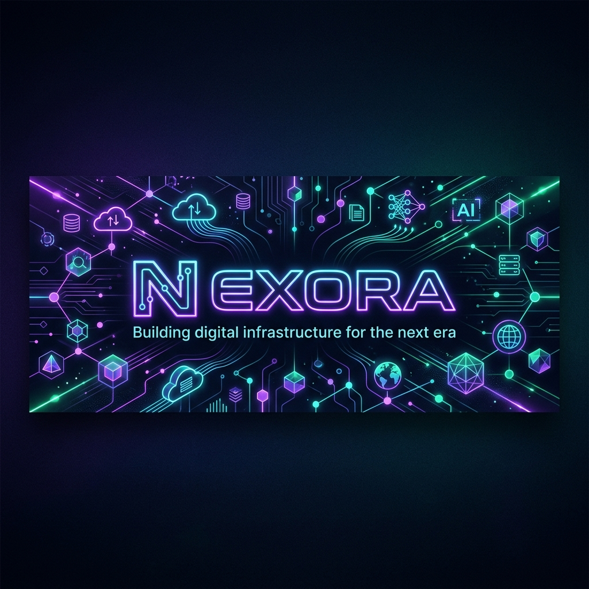

# 🚀 Nexora

<div align="center">
  
</div>

<div align="center">

# NEXORA
### *Building digital infrastructure for the next era.*

Tecnología, automatización e infraestructura diseñada para escalar.

---

[](https://github.com/Nexora-dev-rd)
[](https://github.com/Nexora-dev-rd)
[](https://github.com/Nexora-dev-rd)
[](https://github.com/Nexora-dev-rd)

</div>

---

## 📌 Sobre Nexora

**Nexora** es una empresa enfocada en el diseño, desarrollo y administración de soluciones tecnológicas modernas para empresas, startups y proyectos digitales.

Nuestra misión es construir infraestructura sólida, automatizar procesos críticos y crear ecosistemas digitales escalables que permitan crecer con velocidad, estabilidad y seguridad.

### Pilares de Enfoque
*   🌐 **Cloud Infrastructure & DevOps**: Despliegues robustos y alta disponibilidad.
*   ⚡ **Process Automation & CI/CD**: Eliminación de tareas repetitivas y despliegues automáticos.
*   🧠 **AI Integrations**: Implementación de flujos de trabajo inteligentes potenciados por IA.
*   💻 **Digital Product Development**: Creación de software moderno, mantenible y escalable.

---

## 🎯 Nuestra Visión

> "Crear tecnología que no solo funcione hoy, sino que esté preparada para el mañana."

Creemos que el software debe diseñarse bajo principios claros de mantenimiento y escalabilidad. Buscamos que cada sistema sea:
*   📈 **Escalable** en rendimiento y arquitectura.
*   ⚙️ **Eficiente** en consumo de recursos y costos.
*   🤖 **Automatizable** de inicio a fin.
*   🔒 **Seguro** por diseño y por defecto.

---

## 🛠️ Servicios Principales

### ☁️ Infraestructura Cloud & Servidores
Diseño, aprovisionamiento y mantenimiento de arquitecturas en la nube:
*   **VPS & Dedicated Servers**: Gestión integral de servidores dedicados y virtuales.
*   **Container Orchestration & Docker**: Modularización de aplicaciones con Docker y Docker Compose.
*   **Proxy Reverso & SSL**: Configuraciones seguras de tráfico con NGINX y Traefik.
*   **Monitoreo y Respaldos**: Logs centralizados y sistemas automáticos de backups.

### 🔁 Automatización de Operaciones
Optimización de flujos de trabajo para acelerar la entrega de software:
*   **CI/CD Pipelines**: Automatización de construcciones y despliegues sin interrupciones.
*   **Integraciones y Webhooks**: Conectividad avanzada entre plataformas de terceros.
*   **Scripts & Custom Bots**: Automatización interna para control operativo.

### 🧠 Soluciones potenciadas por IA
Modernización de procesos empresariales mediante inteligencia artificial:
*   **Agentes de Soporte**: Asistentes inteligentes autónomos para atención al cliente.
*   **Flujos de Trabajo Inteligentes**: Integración profunda con APIs de OpenAI/LLMs.
*   **Procesamiento de Datos**: Extracción y análisis automatizado de información no estructurada.

### 💻 Ingeniería y Desarrollo de Software
Creación de plataformas modernas con estándares de alta calidad:
*   **APIs robustas**: Servicios REST y WebSocket de alto rendimiento.
*   **Interfaces dinámicas**: Aplicaciones web rápidas, responsivas y atractivas.

---

## 🔐 Seguridad y Mantenimiento

Priorizamos la estabilidad y la protección de datos en cada una de nuestras implementaciones:

*   🛡️ **Hardening de Servidores**: Configuración avanzada de firewalls y accesos SSH restringidos.
*   🔑 **Secret Management**: Gestión segura de credenciales y variables de entorno.
*   🌐 **SSL/HTTPS**: Cifrado obligatorio de tráfico web y mitigación de ataques básicos de tasa límite (Rate Limiting).
*   💾 **Respaldos Automatizados**: Estrategias de recuperación ante desastres con copias de seguridad periódicas y descentralizadas.

---

## 🛠 Stack Tecnológico

| Capa | Tecnologías |
| :--- | :--- |
| **Backend** |     |
| **Frontend** |    |
| **DevOps & SysAdmin** |     |
| **Databases** |    |
| **Cloud & CDN** |   |
| **Automation** | `APIs` `Webhooks` `CI/CD Pipelines` `Cron Jobs` `Background Workers` |
| **AI Integration** |  `AI Agents` `LLM Automation` `RAG Pipelines` |

---

## 📁 Estructura de Proyectos Habitual

Utilizamos una estructura monorreferencial o modular bien definida para optimizar los tiempos de desarrollo y despliegue:

```bash
nexora/
├── apps/               # Aplicaciones de usuario final (Web, Mobile, Admin)
├── services/           # Microservicios de backend, pasarelas de pago, WebSockets
├── infrastructure/     # Archivos Terraform, Ansible o scripts de aprovisionamiento
├── docker/             # Dockerfiles optimizados para cada entorno (Dev/Prod)
├── nginx/              # Archivos de configuración de ruteo y proxy reverso
├── scripts/            # Scripts de mantenimiento y automatizaciones locales
├── monitoring/         # Dashboards de Grafana/Prometheus y configuraciones de alertas
├── backups/            # Configuración y destinos de copias de seguridad
├── docs/               # Documentación interna de arquitectura y API
└── deployments/        # Pipelines CI/CD e instrucciones de despliegue
```

---

## 🚀 Filosofía de Trabajo

*   **Simplicidad primero**: No agregamos complejidad innecesaria. Preferimos soluciones simples, legibles y eficientes.
*   **Automatizar lo repetitivo**: Si se realiza más de dos veces manualmente, debe convertirse en un script o pipeline.
*   **Seguridad por diseño**: La protección de datos y el control de accesos se planifican desde la primera línea de código.
*   **Optimización continua**: Monitoreamos el rendimiento para asegurar latencias mínimas y alto rendimiento.

---

## 🤝 Colaboración

Trabajamos de la mano con:
*   🚀 **Startups Tecnológicas** que necesitan acelerar su lanzamiento al mercado.
*   🏢 **Empresas Digitales** que requieren escalar su infraestructura actual.
*   💻 **Equipos de Desarrollo** internos que buscan delegar DevOps y automatización.
*   🔌 **Proyectos SaaS** que necesitan una base estable de servidores y monitoreo.

---

## 📬 Contacto y Soporte

Si deseas construir una base tecnológica sólida, robusta y libre de fricción técnica:

*   📧 **Email**: [contacto@nexora.dev](mailto:contacto@nexora.dev)
*   🌐 **Sitio Web**: [nexora.dev](https://nexora.dev)
*   🛠️ **Infraestructura**: Gestionado directamente por Nexora.

---

<p align="center">
  <b>© Nexora</b> - <i>Building infrastructure for what's next.</i>
</p>
